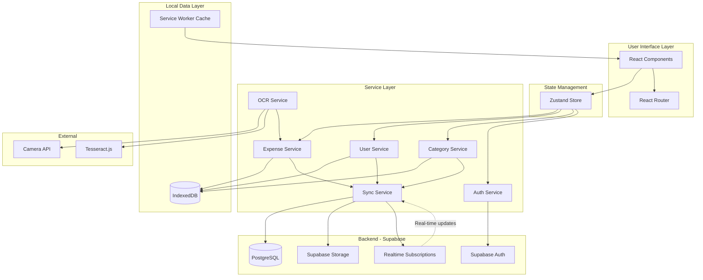

# Design Document: Personal Expense Tracker PWA

## Overview

The Personal Expense Tracker is a Progressive Web Application that enables two users (a couple) to track shared household expenses across all platforms. The application prioritizes simplicity, offline-first functionality, and modern features like OCR receipt scanning.

### Technology Stack

**Frontend:**
- React 18+ with TypeScript for type safety and component architecture
- Vite for fast development and optimized builds
- Tailwind CSS for responsive, utility-first styling
- React Router for navigation
- Zustand for lightweight state management

**Backend & Database:**
- Supabase for PostgreSQL database, authentication, and real-time sync
- Supabase Storage for receipt images
- Row Level Security (RLS) for data access control

**PWA Infrastructure:**
- Workbox for service worker management and offline caching
- IndexedDB (via Dexie.js) for local data persistence and offline support
- Web App Manifest for installability

**OCR Integration:**
- Tesseract.js for client-side OCR processing
- Browser Camera API for image capture
- Canvas API for image preprocessing

## Architecture

### High-Level Architecture



### Offline-First Strategy with Supabase Sync

The application follows an offline-first approach with real-time synchronization:

1. **All data operations** happen locally first (IndexedDB) for instant UI updates
2. **Automatic sync** to Supabase when online
3. **Real-time subscriptions** receive updates from other devices/users instantly
4. **Service Worker** caches all static assets and app shell
5. **Conflict resolution** uses "last write wins" with timestamp comparison
6. **Optimistic updates** show changes immediately, sync in background

### Data Flow

**Write Operations (Create/Update/Delete):**
1. User performs action (e.g., adds expense)
2. Update IndexedDB immediately (optimistic update)
3. Update UI from IndexedDB
4. Queue sync operation
5. Sync to Supabase when online
6. On success: mark as synced
7. On failure: retry with exponential backoff

**Read Operations:**
1. Load from IndexedDB for instant display
2. Subscribe to Supabase real-time updates
3. When remote changes arrive: update IndexedDB and UI
4. Periodic background sync to catch missed updates

**Initial Load:**
1. Check if user is authenticated
2. Load cached data from IndexedDB
3. Fetch latest data from Supabase
4. Merge and update IndexedDB
5. Subscribe to real-time changes

## Components and Interfaces

### Core Components

#### 1. Layout Components

**AppShell**
- Provides main navigation and layout structure
- Includes header with app title and user switcher
- Bottom navigation for mobile (Expenses, Add, Summary)
- Responsive sidebar for desktop

**Navigation**
- Tab-based navigation for main sections
- Floating action button (FAB) for quick expense entry on mobile

#### 2. Expense Components

**ExpenseList**
- Displays paginated list of expenses
- Supports infinite scroll or pagination
- Shows expense cards with: amount, description, category icon, date, user avatar
- Pull-to-refresh on mobile

**ExpenseCard**
- Compact view of single expense
- Tap to expand for details and actions (edit, delete)
- Visual indicators for category (color-coded)
- Receipt thumbnail if available

**ExpenseForm**
- Form for adding/editing expenses
- Fields: amount, description, category dropdown, date picker, user selector
- Category dropdown with "Add New Category" option
- Scan receipt button with camera icon
- Real-time validation feedback
- Auto-save draft to prevent data loss

**CategoryManager**
- List of all categories (default and custom)
- Add new category button
- Edit category (name, icon, color)
- Delete custom categories (with warning if expenses exist)
- Cannot delete default categories

**ExpenseFilters**
- Filter panel with: user filter, category filter, date range picker
- Clear filters button
- Active filter chips display

#### 3. OCR Components

**ReceiptScanner**
- Camera viewfinder interface
- Capture button and gallery upload option
- Image preview with crop/rotate tools
- Processing indicator during OCR
- Extracted data preview with confidence scores

**ImagePreprocessor**
- Adjusts brightness/contrast for better OCR
- Converts to grayscale
- Applies edge detection if needed

#### 4. Summary Components

**ExpenseSummary**
- Total spending display (large, prominent)
- Time period selector (This Month, Last Month, Custom Range)
- Spending by category (pie chart or bar chart)
- Spending by user (comparison view)

**CategoryBreakdown**
- List of categories with amounts and percentages
- Visual progress bars
- Tap to filter expenses by category

#### 5. User Components

**UserProfile**
- Simple profile with name and avatar
- User switcher for quick context switching
- Settings access

**UserSetup**
- First-time setup wizard
- Create two user profiles
- Choose avatars or colors

#### 6. Authentication Components

**LoginForm**
- Email/password login
- Magic link option (passwordless)
- Simple, clean design
- Remember me option

**SignupForm**
- Email/password registration
- Automatic profile creation
- Invite second user option

### Data Models

#### User Model

```typescript
interface User {
  id: string;              // UUID (matches Supabase auth user ID)
  email: string;           // User's email (from Supabase auth)
  name: string;            // User's display name
  avatar?: string;         // Avatar URL (Supabase Storage) or emoji
  color: string;           // Theme color for user
  householdId: string;     // Reference to shared household
  createdAt: Date;
  updatedAt: Date;
}

interface Household {
  id: string;              // UUID
  name: string;            // Household name (e.g., "Smith Family")
  createdAt: Date;
  updatedAt: Date;
}
```

#### Category Model

```typescript
interface Category {
  id: string;              // UUID
  householdId: string;     // Reference to household
  name: string;            // Category name
  icon?: string;           // Icon name or emoji
  color: string;           // Color hex code
  isDefault: boolean;      // True for system categories
  createdAt: Date;
  updatedAt: Date;
}
```

#### Expense Model

```typescript
interface Expense {
  id: string;              // UUID
  householdId: string;     // Reference to household
  userId: string;          // Reference to User
  amount: number;          // Decimal amount (stored as numeric in PostgreSQL)
  description: string;     // Expense description
  categoryId: string;      // Reference to Category
  date: Date;              // Expense date
  receiptImageUrl?: string;// Supabase Storage URL
  ocrData?: OCRData;       // OCR extracted data (JSONB in PostgreSQL)
  createdAt: Date;
  updatedAt: Date;
  syncStatus: 'synced' | 'pending' | 'conflict'; // Local only, not in DB
}

interface OCRData {
  merchantName?: string;
  extractedAmount?: number;
  extractedDate?: Date;
  confidence: number;      // 0-1 confidence score
  rawText: string;         // Full OCR text
}
```

#### Filter Model

```typescript
interface ExpenseFilter {
  userIds?: string[];
  categoryIds?: string[];
  dateFrom?: Date;
  dateTo?: Date;
  searchText?: string;
}
```

### Service Interfaces

#### ExpenseService

```typescript
interface IExpenseService {
  // CRUD operations
  createExpense(expense: Omit<Expense, 'id' | 'createdAt' | 'updatedAt'>): Promise<Expense>;
  getExpense(id: string): Promise<Expense | null>;
  updateExpense(id: string, updates: Partial<Expense>): Promise<Expense>;
  deleteExpense(id: string): Promise<void>;
  
  // Query operations
  listExpenses(filter?: ExpenseFilter, limit?: number, offset?: number): Promise<Expense[]>;
  getTotalAmount(filter?: ExpenseFilter): Promise<number>;
  getCategoryBreakdown(filter?: ExpenseFilter): Promise<CategorySummary[]>;
  getUserBreakdown(filter?: ExpenseFilter): Promise<UserSummary[]>;
}

interface CategorySummary {
  categoryId: string;
  categoryName: string;
  categoryColor: string;
  total: number;
  count: number;
  percentage: number;
}

interface UserSummary {
  userId: string;
  userName: string;
  total: number;
  count: number;
  percentage: number;
}
```

#### UserService

```typescript
interface IUserService {
  createUser(user: Omit<User, 'id' | 'createdAt' | 'updatedAt'>): Promise<User>;
  getUser(id: string): Promise<User | null>;
  updateUser(id: string, updates: Partial<User>): Promise<User>;
  listUsers(): Promise<User[]>;
  getCurrentUser(): Promise<User | null>;
  setCurrentUser(id: string): Promise<void>;
}
```

#### CategoryService

```typescript
interface ICategoryService {
  // CRUD operations
  createCategory(category: Omit<Category, 'id' | 'createdAt' | 'updatedAt'>): Promise<Category>;
  getCategory(id: string): Promise<Category | null>;
  updateCategory(id: string, updates: Partial<Category>): Promise<Category>;
  deleteCategory(id: string): Promise<void>;
  
  // Query operations
  listCategories(): Promise<Category[]>;
  getDefaultCategories(): Promise<Category[]>;
  
  // Initialization
  initializeDefaultCategories(): Promise<void>;
}
```

#### AuthService

```typescript
interface IAuthService {
  // Authentication
  signUp(email: string, password: string, name: string): Promise<User>;
  signIn(email: string, password: string): Promise<User>;
  signInWithMagicLink(email: string): Promise<void>;
  signOut(): Promise<void>;
  
  // Session management
  getCurrentSession(): Promise<Session | null>;
  refreshSession(): Promise<Session>;
  
  // User management
  getCurrentUser(): Promise<User | null>;
  updateProfile(updates: Partial<User>): Promise<User>;
  
  // Household management
  createHousehold(name: string): Promise<Household>;
  inviteToHousehold(email: string): Promise<void>;
  acceptInvite(inviteCode: string): Promise<void>;
}

interface Session {
  accessToken: string;
  refreshToken: string;
  expiresAt: Date;
  user: User;
}
```

#### SyncService

```typescript
interface ISyncService {
  // Sync operations
  syncExpenses(): Promise<void>;
  syncCategories(): Promise<void>;
  syncUsers(): Promise<void>;
  syncAll(): Promise<void>;
  
  // Real-time subscriptions
  subscribeToExpenses(callback: (expense: Expense) => void): () => void;
  subscribeToCategories(callback: (category: Category) => void): () => void;
  
  // Conflict resolution
  resolveConflict(localItem: any, remoteItem: any): any;
  
  // Queue management
  queueOperation(operation: SyncOperation): void;
  processQueue(): Promise<void>;
  getQueueStatus(): QueueStatus;
}

interface SyncOperation {
  id: string;
  type: 'create' | 'update' | 'delete';
  entity: 'expense' | 'category' | 'user';
  data: any;
  timestamp: Date;
  retryCount: number;
}

interface QueueStatus {
  pending: number;
  failed: number;
  lastSync: Date | null;
}
```

```typescript
interface IOCRService {
  // Image capture
  captureFromCamera(): Promise<Blob>;
  selectFromGallery(): Promise<Blob>;
  
  // OCR processing
  processReceipt(image: Blob): Promise<OCRResult>;
  preprocessImage(image: Blob): Promise<Blob>;
  
  // Data extraction
  extractAmount(text: string): number | null;
  extractDate(text: string): Date | null;
  extractMerchant(text: string): string | null;
}

interface OCRResult {
  text: string;
  confidence: number;
  amount?: number;
  date?: Date;
  merchant?: string;
}
```

## Data Storage

### Supabase Database Schema

```sql
-- Enable UUID extension
CREATE EXTENSION IF NOT EXISTS "uuid-ossp";

-- Households table
CREATE TABLE households (
  id UUID PRIMARY KEY DEFAULT uuid_generate_v4(),
  name TEXT NOT NULL,
  created_at TIMESTAMPTZ DEFAULT NOW(),
  updated_at TIMESTAMPTZ DEFAULT NOW()
);

-- Users table (extends Supabase auth.users)
CREATE TABLE users (
  id UUID PRIMARY KEY REFERENCES auth.users(id) ON DELETE CASCADE,
  email TEXT NOT NULL UNIQUE,
  name TEXT NOT NULL,
  avatar TEXT,
  color TEXT NOT NULL,
  household_id UUID REFERENCES households(id) ON DELETE CASCADE,
  created_at TIMESTAMPTZ DEFAULT NOW(),
  updated_at TIMESTAMPTZ DEFAULT NOW()
);

-- Categories table
CREATE TABLE categories (
  id UUID PRIMARY KEY DEFAULT uuid_generate_v4(),
  household_id UUID REFERENCES households(id) ON DELETE CASCADE,
  name TEXT NOT NULL,
  icon TEXT,
  color TEXT NOT NULL,
  is_default BOOLEAN DEFAULT FALSE,
  created_at TIMESTAMPTZ DEFAULT NOW(),
  updated_at TIMESTAMPTZ DEFAULT NOW(),
  UNIQUE(household_id, name)
);

-- Expenses table
CREATE TABLE expenses (
  id UUID PRIMARY KEY DEFAULT uuid_generate_v4(),
  household_id UUID REFERENCES households(id) ON DELETE CASCADE,
  user_id UUID REFERENCES users(id) ON DELETE CASCADE,
  category_id UUID REFERENCES categories(id) ON DELETE SET NULL,
  amount NUMERIC(10, 2) NOT NULL,
  description TEXT NOT NULL,
  date DATE NOT NULL,
  receipt_image_url TEXT,
  ocr_data JSONB,
  created_at TIMESTAMPTZ DEFAULT NOW(),
  updated_at TIMESTAMPTZ DEFAULT NOW()
);

-- Indexes for performance
CREATE INDEX idx_expenses_household ON expenses(household_id);
CREATE INDEX idx_expenses_user ON expenses(user_id);
CREATE INDEX idx_expenses_category ON expenses(category_id);
CREATE INDEX idx_expenses_date ON expenses(date DESC);
CREATE INDEX idx_expenses_household_date ON expenses(household_id, date DESC);

CREATE INDEX idx_categories_household ON categories(household_id);
CREATE INDEX idx_users_household ON users(household_id);

-- Row Level Security (RLS) Policies

-- Enable RLS
ALTER TABLE households ENABLE ROW LEVEL SECURITY;
ALTER TABLE users ENABLE ROW LEVEL SECURITY;
ALTER TABLE categories ENABLE ROW LEVEL SECURITY;
ALTER TABLE expenses ENABLE ROW LEVEL SECURITY;

-- Households: Users can only see their own household
CREATE POLICY "Users can view their household"
  ON households FOR SELECT
  USING (id IN (
    SELECT household_id FROM users WHERE id = auth.uid()
  ));

CREATE POLICY "Users can update their household"
  ON households FOR UPDATE
  USING (id IN (
    SELECT household_id FROM users WHERE id = auth.uid()
  ));

-- Users: Can view users in same household
CREATE POLICY "Users can view household members"
  ON users FOR SELECT
  USING (household_id IN (
    SELECT household_id FROM users WHERE id = auth.uid()
  ));

CREATE POLICY "Users can update their own profile"
  ON users FOR UPDATE
  USING (id = auth.uid());

-- Categories: Can view/manage categories in their household
CREATE POLICY "Users can view household categories"
  ON categories FOR SELECT
  USING (household_id IN (
    SELECT household_id FROM users WHERE id = auth.uid()
  ));

CREATE POLICY "Users can create household categories"
  ON categories FOR INSERT
  WITH CHECK (household_id IN (
    SELECT household_id FROM users WHERE id = auth.uid()
  ));

CREATE POLICY "Users can update household categories"
  ON categories FOR UPDATE
  USING (household_id IN (
    SELECT household_id FROM users WHERE id = auth.uid()
  ));

CREATE POLICY "Users can delete custom categories"
  ON categories FOR DELETE
  USING (
    household_id IN (SELECT household_id FROM users WHERE id = auth.uid())
    AND is_default = FALSE
  );

-- Expenses: Can view/manage expenses in their household
CREATE POLICY "Users can view household expenses"
  ON expenses FOR SELECT
  USING (household_id IN (
    SELECT household_id FROM users WHERE id = auth.uid()
  ));

CREATE POLICY "Users can create household expenses"
  ON expenses FOR INSERT
  WITH CHECK (household_id IN (
    SELECT household_id FROM users WHERE id = auth.uid()
  ));

CREATE POLICY "Users can update household expenses"
  ON expenses FOR UPDATE
  USING (household_id IN (
    SELECT household_id FROM users WHERE id = auth.uid()
  ));

CREATE POLICY "Users can delete household expenses"
  ON expenses FOR DELETE
  USING (household_id IN (
    SELECT household_id FROM users WHERE id = auth.uid()
  ));

-- Triggers for updated_at
CREATE OR REPLACE FUNCTION update_updated_at_column()
RETURNS TRIGGER AS $$
BEGIN
  NEW.updated_at = NOW();
  RETURN NEW;
END;
$$ language 'plpgsql';

CREATE TRIGGER update_households_updated_at BEFORE UPDATE ON households
  FOR EACH ROW EXECUTE FUNCTION update_updated_at_column();

CREATE TRIGGER update_users_updated_at BEFORE UPDATE ON users
  FOR EACH ROW EXECUTE FUNCTION update_updated_at_column();

CREATE TRIGGER update_categories_updated_at BEFORE UPDATE ON categories
  FOR EACH ROW EXECUTE FUNCTION update_updated_at_column();

CREATE TRIGGER update_expenses_updated_at BEFORE UPDATE ON expenses
  FOR EACH ROW EXECUTE FUNCTION update_updated_at_column();
```

### Supabase Storage

**Buckets:**
- `receipts`: Store receipt images
  - Public: false (authenticated users only)
  - File size limit: 5 MB
  - Allowed MIME types: image/jpeg, image/png, image/webp
  - Path structure: `{household_id}/{expense_id}/{filename}`

**Storage Policies:**
```sql
-- Users can upload receipts to their household folder
CREATE POLICY "Users can upload household receipts"
  ON storage.objects FOR INSERT
  WITH CHECK (
    bucket_id = 'receipts' AND
    (storage.foldername(name))[1] IN (
      SELECT household_id::text FROM users WHERE id = auth.uid()
    )
  );

-- Users can view household receipts
CREATE POLICY "Users can view household receipts"
  ON storage.objects FOR SELECT
  USING (
    bucket_id = 'receipts' AND
    (storage.foldername(name))[1] IN (
      SELECT household_id::text FROM users WHERE id = auth.uid()
    )
  );

-- Users can delete household receipts
CREATE POLICY "Users can delete household receipts"
  ON storage.objects FOR DELETE
  USING (
    bucket_id = 'receipts' AND
    (storage.foldername(name))[1] IN (
      SELECT household_id::text FROM users WHERE id = auth.uid()
    )
  );
```

### Local IndexedDB Schema (for offline support)

```typescript
// Database: ExpenseTrackerDB, Version: 1
// Mirrors Supabase structure for offline-first functionality

// Object Store: households
{
  keyPath: 'id'
}

// Object Store: users
{
  keyPath: 'id',
  indexes: [
    { name: 'name', keyPath: 'name', unique: false }
  ]
}

// Object Store: categories
{
  keyPath: 'id',
  indexes: [
    { name: 'name', keyPath: 'name', unique: false },
    { name: 'isDefault', keyPath: 'isDefault', unique: false }
  ]
}

// Object Store: expenses
{
  keyPath: 'id',
  indexes: [
    { name: 'userId', keyPath: 'userId', unique: false },
    { name: 'categoryId', keyPath: 'categoryId', unique: false },
    { name: 'date', keyPath: 'date', unique: false },
    { name: 'userId_date', keyPath: ['userId', 'date'], unique: false }
  ]
}

// Object Store: settings
{
  keyPath: 'key'
}

// Object Store: sync_queue (for offline operations)
{
  keyPath: 'id',
  indexes: [
    { name: 'timestamp', keyPath: 'timestamp', unique: false },
    { name: 'status', keyPath: 'status', unique: false }
  ]
}
```

### Service Worker Caching Strategy

**App Shell (Cache First)**
- HTML, CSS, JavaScript bundles
- Fonts, icons
- Fallback offline page

**Images (Cache First, with Network Fallback)**
- User avatars
- Category icons
- Receipt images (stored in IndexedDB, not cache)

**API Calls (Network First, with Cache Fallback)**
- Supabase API calls for data sync
- Supabase Storage for receipt images

## Error Handling

### Error Types

```typescript
enum ErrorType {
  NETWORK_ERROR = 'NETWORK_ERROR',
  STORAGE_ERROR = 'STORAGE_ERROR',
  VALIDATION_ERROR = 'VALIDATION_ERROR',
  OCR_ERROR = 'OCR_ERROR',
  PERMISSION_ERROR = 'PERMISSION_ERROR',
  AUTH_ERROR = 'AUTH_ERROR',
  SYNC_ERROR = 'SYNC_ERROR',
  UNKNOWN_ERROR = 'UNKNOWN_ERROR'
}

interface AppError {
  type: ErrorType;
  message: string;
  details?: any;
  timestamp: Date;
}
```

### Error Handling Strategy

1. **User-Facing Errors**: Display toast notifications with clear, actionable messages
2. **Validation Errors**: Inline form validation with helpful hints
3. **Storage Errors**: Attempt recovery, notify user if data loss risk
4. **OCR Errors**: Graceful fallback to manual entry with explanation
5. **Permission Errors**: Clear instructions on how to grant permissions
6. **Network Errors**: Queue operations for retry when online
7. **Auth Errors**: Clear session and redirect to login
8. **Sync Errors**: Show sync status indicator, allow manual retry

### Error Recovery

- **Auto-retry** for transient network errors (exponential backoff)
- **Data backup** before destructive operations
- **Error logging** to IndexedDB for debugging (user can view/clear)
- **Graceful degradation** when features unavailable (e.g., no camera)

## Testing Strategy

### Unit Tests

**Target Coverage: 80%+**

- Service layer functions (ExpenseService, UserService, OCRService)
- Data validation functions
- Utility functions (date formatting, currency formatting, text parsing)
- State management logic (Zustand stores)

**Tools**: Vitest, Testing Library

### Integration Tests

- Component integration with services
- IndexedDB operations
- Service Worker registration and caching
- OCR pipeline (image capture → processing → data extraction)

**Tools**: Vitest, Testing Library, Playwright

### E2E Tests

**Critical User Flows**:
1. Sign up and create household
2. Invite second user to household
3. First-time setup (create user profiles)
4. Add expense manually
5. Add expense via OCR
6. View and filter expenses
7. Edit and delete expense
8. View summaries
9. Offline functionality (add expense while offline, sync when online)
10. Real-time sync (see partner's expenses appear instantly)

**Tools**: Playwright

### PWA Testing

- Lighthouse PWA audit (score 90+)
- Install prompt functionality
- Offline mode testing
- Service Worker update flow
- Cross-browser testing (Chrome, Safari, Firefox)
- Cross-device testing (Desktop, Android, iOS)

### OCR Testing

- Test with various receipt types (printed, handwritten, faded)
- Test with different lighting conditions
- Test with different camera qualities
- Measure accuracy and confidence scores
- Test fallback to manual entry

## Performance Considerations

### Optimization Strategies

1. **Code Splitting**: Lazy load OCR components (Tesseract.js is large)
2. **Image Optimization**: Compress receipt images before storage
3. **Virtual Scrolling**: For large expense lists (react-window)
4. **Debounced Search**: Prevent excessive filtering operations
5. **Memoization**: Cache expensive calculations (summaries, breakdowns)
6. **Service Worker**: Aggressive caching of static assets

### Performance Targets

- **First Contentful Paint**: < 1.5s
- **Time to Interactive**: < 3.5s
- **Lighthouse Performance Score**: 90+
- **Bundle Size**: < 500KB (initial, excluding OCR)
- **OCR Processing Time**: < 5s for typical receipt

## Security Considerations

### Data Security

- HTTPS only (enforced by Supabase and PWA requirements)
- JWT-based authentication via Supabase Auth
- Row Level Security (RLS) ensures users only access their household data
- Receipt images stored in Supabase Storage with access control
- No sensitive financial data (no bank accounts, cards)
- Passwords hashed by Supabase (bcrypt)

### Backend Security (Supabase)

- Row Level Security (RLS) policies enforce data isolation
- JWT tokens with short expiration (1 hour)
- Refresh tokens for session management
- Rate limiting on authentication endpoints
- CORS configured for app domain only
- SQL injection protection (parameterized queries)
- Storage bucket policies restrict file access

### Privacy

- No analytics or tracking by default
- No third-party services (except Supabase and OCR library)
- Data stored in user's chosen Supabase region
- Clear data deletion option (deletes from Supabase and local storage)
- Email only used for authentication
- No data sharing with third parties

## Accessibility

### WCAG 2.1 AA Compliance

- **Keyboard Navigation**: All interactive elements accessible via keyboard
- **Screen Reader Support**: Proper ARIA labels and semantic HTML
- **Color Contrast**: Minimum 4.5:1 ratio for text
- **Focus Indicators**: Clear visual focus states
- **Touch Targets**: Minimum 44x44px for mobile
- **Form Labels**: All inputs properly labeled
- **Error Announcements**: Screen reader announcements for errors

### Responsive Design

- Mobile-first approach
- Breakpoints: 640px (sm), 768px (md), 1024px (lg), 1280px (xl)
- Touch-friendly UI on mobile
- Optimized layouts for tablet and desktop

## Deployment

### Build Process

1. TypeScript compilation with type checking
2. Vite production build with minification
3. Service Worker generation with Workbox
4. Asset optimization (images, fonts)
5. Generate Web App Manifest

### Hosting Options

- **Frontend**: Netlify, Vercel, GitHub Pages, Cloudflare Pages
- **Backend**: Supabase (managed PostgreSQL + Auth + Storage)
- **Requirements**: HTTPS (required for PWA), Custom domain (optional)

### Supabase Setup

1. Create Supabase project
2. Run database migrations (create tables, RLS policies)
3. Create storage bucket for receipts
4. Configure authentication providers (email/password, magic link)
5. Set up environment variables in frontend
6. Configure CORS for app domain

### PWA Requirements Checklist

- ✅ HTTPS served
- ✅ Web App Manifest with icons
- ✅ Service Worker registered
- ✅ Offline fallback page
- ✅ Responsive design
- ✅ Fast load times
- ✅ Cross-browser compatible

## Future Enhancements

### Phase 2 Features

1. **Shared Budgets**: Set category budgets with alerts
2. **Recurring Expenses**: Auto-add monthly bills
3. **Export Data**: CSV/PDF export for records
4. **Multi-Currency**: Support for different currencies
5. **Attachments**: Multiple receipt images per expense
6. **Notes**: Add detailed notes to expenses
7. **Tags**: Custom tags for flexible categorization
8. **Household Invites**: Invite via email with magic link

### Phase 3 Features

1. **Analytics Dashboard**: Trends, predictions, insights
2. **Split Expenses**: Mark expenses as split between users
3. **Reimbursements**: Track who owes whom
4. **Notifications**: Reminders and spending alerts
5. **Dark Mode**: Theme switching
6. **Localization**: Multi-language support
